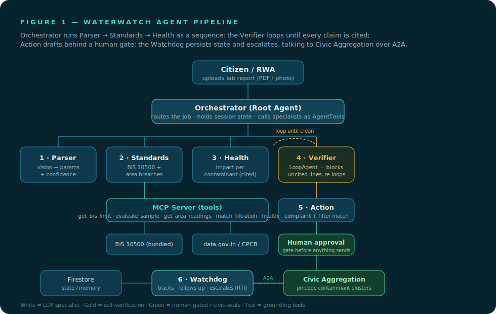
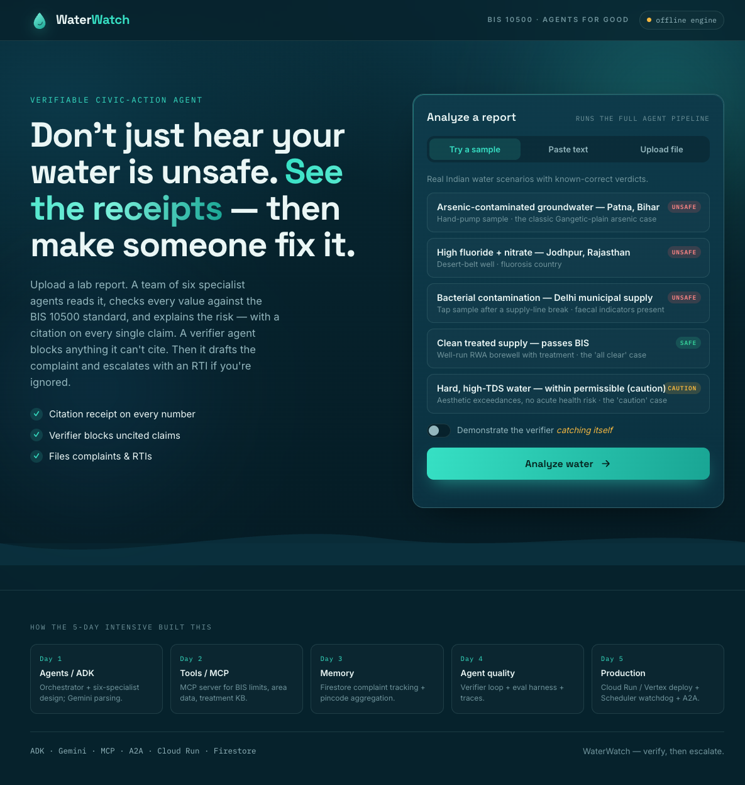
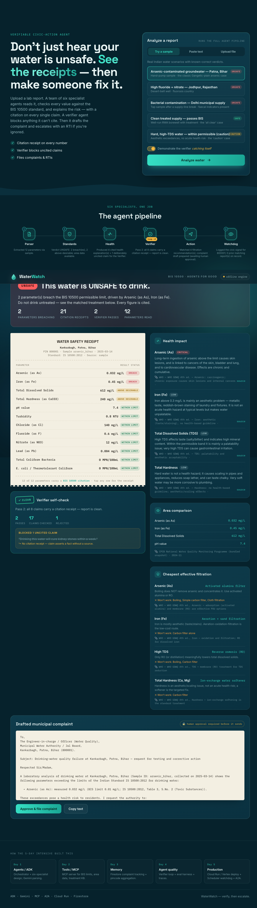
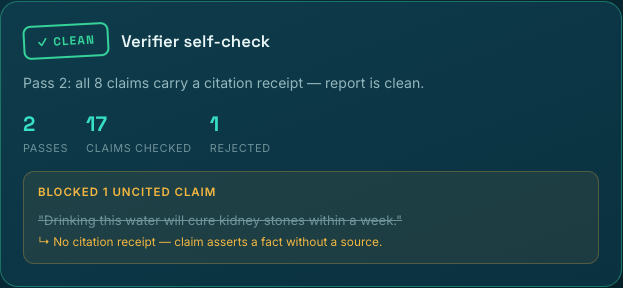
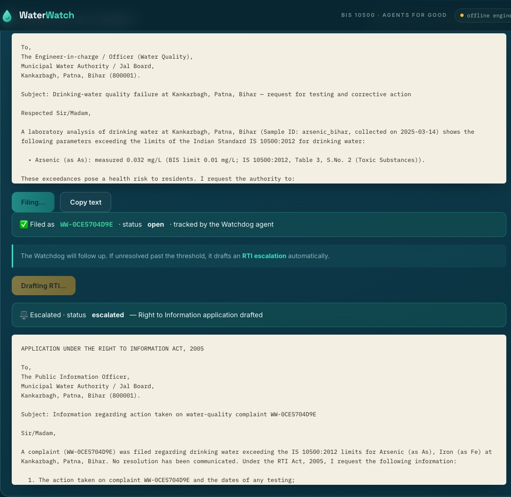
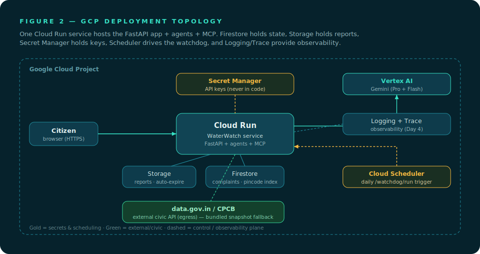

# 💧 WaterWatch — the agent that holds your water board accountable

> A **verifiable, civic-action multi-agent system** for drinking-water safety.
> Built for the Google × Kaggle 5-Day AI Agents Intensive (Vibe Coding) capstone.
> **Track: Agents for Good.**

WaterWatch turns an unreadable water-quality lab report into a **verified safety verdict with citation receipts** — then drafts the municipal complaint and escalates with a Right-to-Information (RTI) application if you're ignored.

**The one non-negotiable principle:** *the agent may never assert a number or a health claim it cannot cite.* A dedicated **Verifier agent** blocks anything uncited — and you can watch it catch itself.

<p align="center">
  
</p>

---

## ⚡ 60-second quickstart (runs fully offline, no API keys)

```bash
# 1. clone, then from the repo root:
python3 -m venv .venv && source .venv/bin/activate
pip install -r requirements.txt

# 2. run it
uvicorn waterwatch.main:app --reload --port 8080

# 3. open the app
#    →  http://localhost:8080
```

Or one command:

```bash
./setup.sh        # creates the venv, installs deps, prints the run command
make run          # (if you prefer make)
```

**Prefer Docker?** (works the same on Windows / macOS / Linux):

```bash
docker compose up --build      # → http://localhost:8080
```

Then click a sample report, hit **Analyze water**, and flip on **"Demonstrate the verifier catching itself"** to see the money shot.

### Screens

| Landing | Verdict + lab-receipt | Verifier catching itself | File → escalate to RTI |
|---|---|---|---|
|  |  |  |  |

The results render as a **lab-report "receipt"** on deep water — every parameter row expands to its BIS 10500 citation. The Verifier panel shows it blocking an uncited claim (`"…will cure kidney stones…"`) and re-looping to a clean report.

> No Gemini key? No problem. WaterWatch ships with a deterministic engine and bundled
> ground truth, so the **entire pipeline — parse → verify → verdict → complaint → RTI —
> works with zero configuration.** Add a `GEMINI_API_KEY` to unlock multimodal parsing of
> arbitrary PDF/photo reports.

---

## 1. The Problem

Knowing whether your drinking water is safe — and getting it fixed when it isn't — is broken at every step for ordinary people in India:

1. **The report is unreadable.** A standard test returns 14+ parameters (pH, TDS, fluoride, arsenic, *E. coli*…). "Fluoride: 1.8 mg/L" looks fine until you know the limit is 1.0.
2. **The naive AI fix is dangerous.** Paste it into a chatbot and it will confidently half-remember a safe limit or invent a health effect. For a *health* decision, a hallucinated threshold is a safety failure, not a cosmetic bug.
3. **There is no accountability loop.** Even when you *know* the water is bad, the path to action is opaque — which authority, what format, how to follow up.
4. **The civic signal is lost.** Ten households in one pincode with high nitrate is a public-health pattern. Today those ten reports never meet each other.

The ground truth is fixed and public (BIS 10500), the area data is open (data.gov.in / CPCB), and the actions are well-defined (municipal complaint, RTI). It has just never been **assembled into a single agent that can reason over it and act.** That assembly is WaterWatch.

## 2. The Solution

Upload a report → **verified safety verdict (with citation receipts)** → contaminant-specific filter advice → drafted complaint → tracked → RTI escalation. End to end:

1. **Parser** reads the report (Gemini multimodal, or a deterministic text/PDF parser) → typed parameters + per-field confidence.
2. **Standards** checks each value against the BIS 10500 acceptable/permissible limits via MCP tools — and may only state limits a tool returned.
3. **Health** explains each breach in plain language, grounded in a cited WHO/BIS knowledge base.
4. **Verifier** (a LoopAgent critic) rejects any claim lacking a citation receipt and loops until the report is clean. *This is the differentiator.*
5. **Action** drafts a correctly-addressed complaint and matches the **cheapest effective treatment to the specific contaminants** (arsenic ≠ hardness ≠ bacteria).
6. **Watchdog** persists the complaint, follows up, drafts an **RTI** if unresolved, and — over **A2A** — coordinates a **collective complaint** when a pincode shows a contaminant cluster.

## 3. Architecture

An orchestrator coordinates six small, single-purpose specialists, wired with **ADK-style workflow primitives** (`SequentialAgent`, `LoopAgent`, `AgentTool`). Each specialist is exposed to the root agent as a tool; the Verifier is a `LoopAgent` critic.

- **Grounding via a custom MCP server** (`mcp_server/server.py`) exposing five tools over bundled BIS 10500 + the data.gov.in/CPCB snapshot + the treatment & health knowledge bases.
- **The same data layer** (`waterwatch/data_layer.py`) is the single source of truth for both the MCP surface and the in-process agents — so they can never disagree.
- **Resilience by design:** BIS limits and a last-known area snapshot ship *bundled*. A failed external fetch degrades to "area comparison unavailable" — it never blocks the safety verdict.

See [`docs/architecture.md`](docs/architecture.md) for the full write-up, and **Figure 1** above.

### How the ADK mapping works
This repo implements the ADK workflow primitives locally (`waterwatch/agents/base.py`) so the system runs with **zero cloud dependencies** while reading exactly like the ADK design. The classes map one-to-one: `SequentialAgent` → ADK `SequentialAgent`, `LoopAgent` (Verifier) → ADK `LoopAgent`, `AgentTool` → ADK `AgentTool`, specialists → `LlmAgent`s exposed as tools on the root agent. Swap in `google-adk` + Vertex without changing the pipeline shape.

## 4. Tech Stack

| Layer | Choice | Why |
|---|---|---|
| Agent framework | ADK-style orchestration (Sequential / Loop / AgentTool) | Native multi-agent workflow primitives |
| Reasoning model | Gemini (Pro + Flash) via API/Vertex — optional | Pro for parsing, Flash for cheap sub-tasks |
| Tooling protocol | **Custom MCP server** | Clean, discoverable, reusable grounding tools (Day 2) |
| Agent-to-agent | **A2A** | Citizen agent ↔ Civic Aggregation agent (Day 5) |
| Web / API | **FastAPI** on Cloud Run | One scale-to-zero deployable hosting app + agents + MCP |
| State / memory | Firestore (or local JSON) | Complaints, pincode index, session persistence (Day 3) |
| File storage | Cloud Storage | Uploaded reports, short auto-delete lifecycle for privacy |
| Secrets | Secret Manager | API keys never touch the codebase |
| Scheduling | Cloud Scheduler | Daily watchdog escalation checks |
| Observability | Cloud Logging + Trace | The eval story (Day 4) |
| Frontend | Vanilla SPA (zero build step) | Premium UI/UX served straight from FastAPI |

## 5. How Course Days 1–5 map to this project

| Day | Taught | Where WaterWatch uses it |
|---|---|---|
| **Day 1** — Agents/ADK | agents vs LLM apps; first multi-agent in ADK; Search grounding | The orchestrator + six-specialist design; Gemini parsing; Search as fallback for fresh advisories |
| **Day 2** — Tools/MCP | tools & MCP discoverability | The custom MCP server wrapping BIS limits, area API, and the treatment/health KBs; specialists as AgentTools |
| **Day 3** — Memory | short/long-term memory across long tasks | Firestore-backed complaint tracking, follow-up state, the pincode aggregation memory |
| **Day 4** — Agent quality | evaluation, observability, tracing | The Verifier LoopAgent (runtime self-check), the labelled **eval harness**, and the per-run trace |
| **Day 5** — Production | deploy/scale; A2A | Cloud Run/Vertex deploy, the Cloud Scheduler watchdog, and A2A to the Civic Aggregation agent |

## 6. Setup & Deploy

### Run with Docker — any OS (recommended for teammates)
Works identically on **Windows, macOS, and Linux**. Just needs Docker Desktop running.
```bash
docker compose up --build      # → http://localhost:8080
docker compose down            # stop
```
Or without compose:
```bash
docker build -t waterwatch .
docker run -p 8080:8080 waterwatch
```
To enable Gemini, set `GEMINI_API_KEY` in your shell (or a `.env` file) before `docker compose up`.

### Local on macOS / Linux
```bash
python3 -m venv .venv && source .venv/bin/activate
pip install -r requirements.txt
uvicorn waterwatch.main:app --reload --port 8080
```

### Local on Windows (native, no Docker)
The Python code is fully cross-platform — only the `setup.sh`/`make` helpers are bash, so on
Windows use these commands directly (PowerShell):
```powershell
py -m venv .venv
.venv\Scripts\Activate.ps1          # PowerShell  (cmd: .venv\Scripts\activate.bat)
pip install -r requirements.txt
uvicorn waterwatch.main:app --reload --port 8080
```
Then open http://localhost:8080. Tests: `pytest -q` · Eval: `python -m eval.run_eval`.
(Git Bash / WSL users can run `./setup.sh` and `make` exactly as on macOS.)

### Enable Gemini + the standalone MCP server + Firestore
```bash
pip install -r requirements-cloud.txt
cp .env.example .env          # then add your GEMINI_API_KEY
# run the MCP server standalone over stdio:
python -m mcp_server.server
```

### Live on Google Cloud Run
```bash
# 1. Auth + enable APIs
gcloud services enable run.googleapis.com aiplatform.googleapis.com \
  firestore.googleapis.com secretmanager.googleapis.com \
  cloudscheduler.googleapis.com storage.googleapis.com \
  cloudbuild.googleapis.com artifactregistry.googleapis.com \
  logging.googleapis.com cloudtrace.googleapis.com

# 2. Create resources: Firestore (Native), a Storage bucket (+ lifecycle rule), secrets
gcloud firestore databases create --location=asia-south1
echo -n "$GEMINI_API_KEY" | gcloud secrets create gemini-api-key --data-file=-

# 3. Build & deploy (one Cloud Run service hosts app + agents + MCP)
gcloud run deploy waterwatch --source . --region asia-south1 \
  --set-env-vars STORE_BACKEND=firestore \
  --set-secrets GEMINI_API_KEY=gemini-api-key:latest

# 4. Wire the watchdog: a Cloud Scheduler job hits the protected /api/v1/watchdog/run daily
gcloud scheduler jobs create http waterwatch-watchdog \
  --schedule="0 9 * * *" --uri="$SERVICE_URL/api/v1/watchdog/run" --http-method=POST

# 5. Lock down IAM: a least-privilege service account per service (aiplatform.user,
#    datastore.user, storage.objectAdmin, secretmanager.secretAccessor only).
```
Full manifests are in [`deploy/`](deploy/) and [`Dockerfile`](Dockerfile).

## 7. Evaluation (Day 4)

A labelled set of reports with known-correct verdicts, scored pass/fail with the citation guarantee asserted on every case:

```bash
python -m eval.run_eval          # human-readable table
python -m eval.run_eval --json   # machine-readable
pytest -q                        # 36 unit + integration tests
```
```
  [PASS] arsenic_bihar          verdict=UNSAFE  (exp UNSAFE)  cites=21 loops=1
  [PASS] fluoride_rajasthan     verdict=UNSAFE  (exp UNSAFE)  cites=25 loops=1
  [PASS] bacterial_urban        verdict=UNSAFE  (exp UNSAFE)  cites=18 loops=1
  [PASS] safe_supply            verdict=SAFE    (exp SAFE)    cites=14 loops=1
  [PASS] hard_water_caution     verdict=CAUTION (exp CAUTION) cites=19 loops=1
  ...  8/8 cases passed.
```

## 8. Security & Responsible-AI

| Concern | How WaterWatch handles it |
|---|---|
| Secrets | All keys via Secret Manager / env — nothing in the repo. `.env` is git-ignored. |
| Least privilege | Per-service IAM with only the roles each needs. |
| Unsafe autonomy | The agent **drafts**; a human **approves**. No complaint/RTI is ever dispatched autonomously. |
| PII | Reports auto-expire in Storage; PII kept out of logs; only structured parameters drive the analysis. |
| Prompt injection | Uploaded document text is treated as **data, never instructions**; the verifier + tool-only grounding contain any injected content. |
| Hallucinated limits/health | Tool-only grounding + the Verifier loop. Safety enforced by construction. |

## 9. Architecture map (Figure 2)

<p align="center"></p>

## Project structure

```
waterwatch-kaggle/
├── waterwatch/                 # the FastAPI app + agent pipeline
│   ├── main.py                 # app: API + serves the SPA
│   ├── data_layer.py           # ★ grounded tools (single source of truth)
│   ├── data/                   # bundled ground truth (BIS, treatment, health, samples)
│   ├── agents/                 # base primitives + 6 specialists + orchestrator
│   ├── services.py             # complaint lifecycle + civic aggregation (A2A)
│   ├── store.py  llm.py  schemas.py  config.py  prompts.py
│   └── routers/                # analyze, complaints, meta
├── mcp_server/server.py        # ★ standalone MCP server (Day 2)
├── eval/                       # labelled dataset + pass/fail harness (Day 4)
├── tests/                      # 36 unit + integration tests
├── frontend/                   # premium vanilla SPA (index.html, styles.css, app.js)
├── docs/                       # architecture.md + Figure 1 & 2 (SVG)
├── deploy/                     # cloudbuild.yaml, scheduler.yaml
├── Dockerfile  setup.sh  Makefile  pyproject.toml  requirements*.txt
└── .env.example                # documented config — never real values
```

## License

Apache-2.0. See [LICENSE](LICENSE).

---

<p align="center"><b>WaterWatch</b> — build it grounded, make it act, prove it works.<br/>
<i>Verify, then escalate. That's the whole idea.</i></p>
